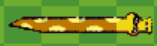
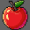
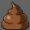
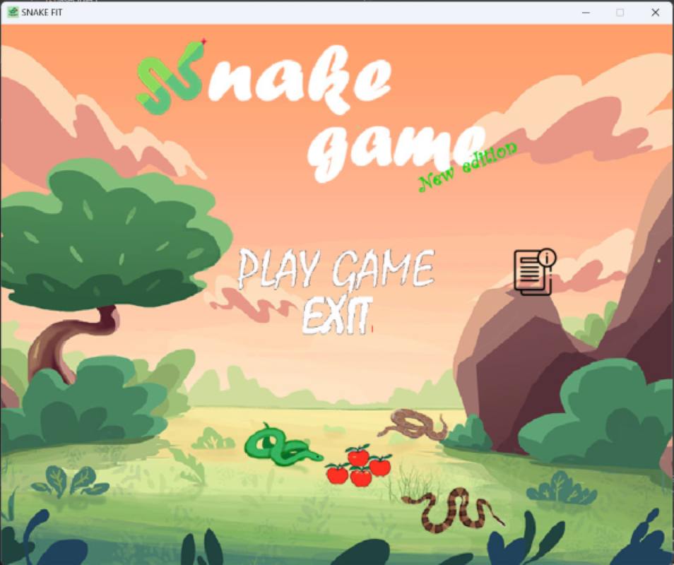
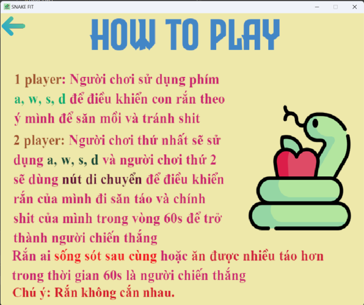
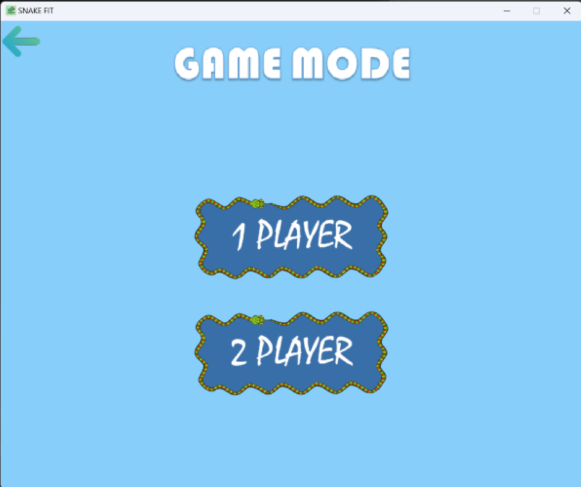
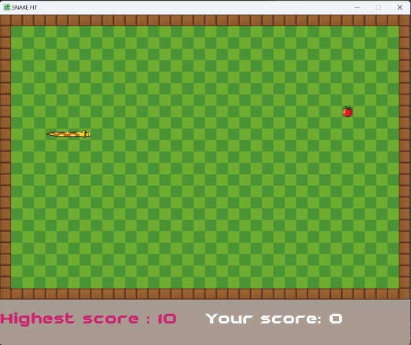
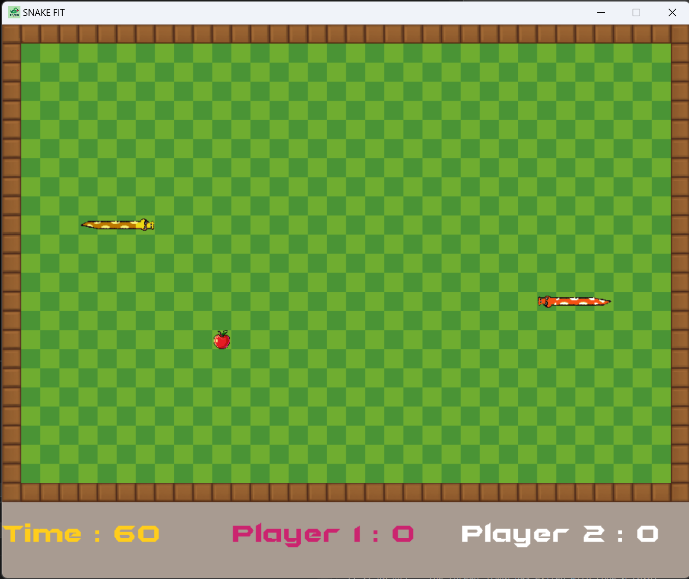
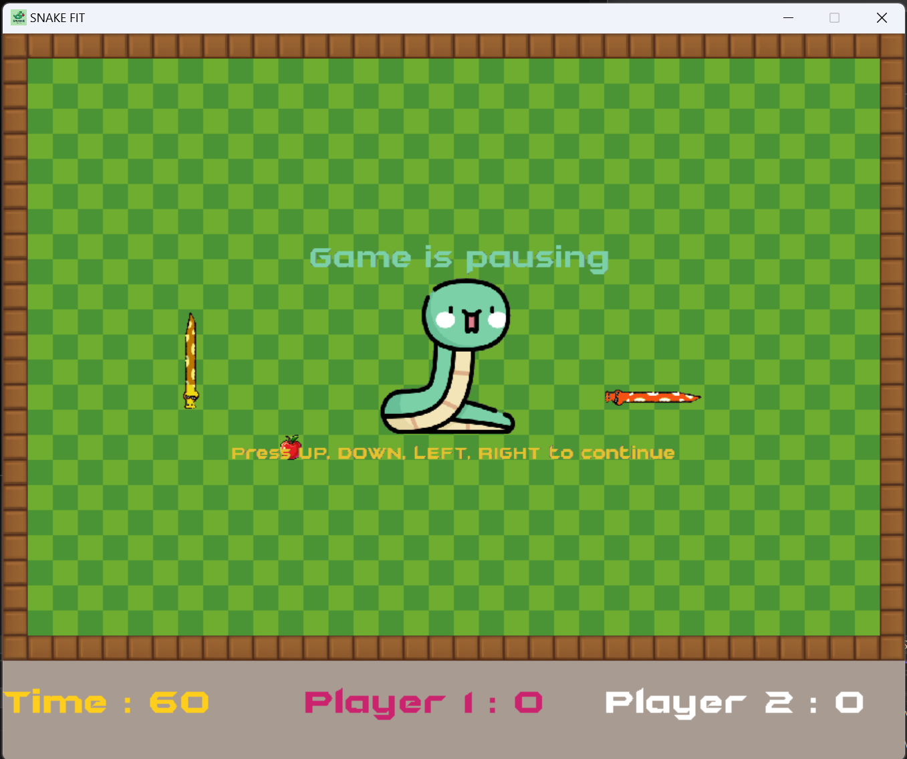
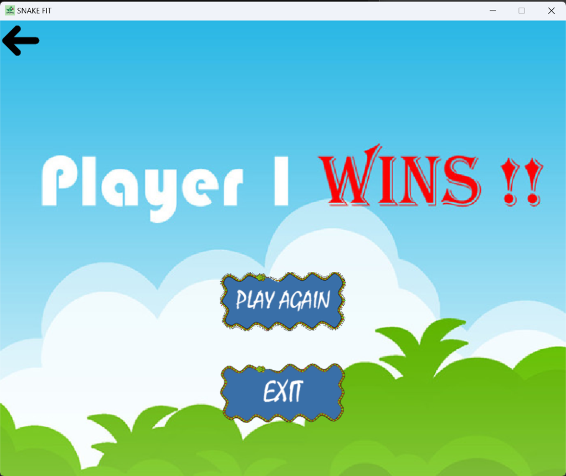

# ***SNAKE FIT*** 

## **Introduction** 

+ Họ và tên: *Nguyễn Văn An - K68CC - UET* 
+ Mã sinh viên: *23020002*
+ Tên game bài tập lớn: **SNAKE FIT**  *(A.K.A RẮN SĂN MỒI)*
## **Tổng quan**
 SNAKE FIT là sản phẩm dự án lớn của mình trong môn Lập trình nâng cao( Trường đại học Công Nghệ - Đại học Quốc gia Hà Nội )  do thầy Lê Đức Trọng và thầy Trần Trường Thủy phụ trách.
 Đây là game được code bằng ngôn ngữ C++ có sử dụng thư viện ngoài là SDL 2.0 và có thể chạy được trên môi trường Window sau đây mình sẽ giới thiệu và hướng dẫn mọi người có thể tải và chơi con game này.
## **Mục lục**
1. [1. Giới thiệu](#gioithieu)
   - [i. Cấu trúc và hướng dẫn chơi game](#cautrucvahuongdanchoi)
    + [Thành phần game](#thanhphangame)
    + [Hướng dẫn chơi](#huongdanchoi)
    + [Điều khiển](#dieukhien)
    + [Hình ảnh game](#hinhanhgame)
   - [ii. Cài đặt](#caidat)
2. [2. Chi tiết](#chitiet)
   - [i. Chức năng và kiến thức áp dụng](#cacchucnangvakienthucapdung)
   - [ii. Nguồn tham khảo](#nguonthamkhao)
3. [3. Tổng kết](#tongket)
   - [i. Điều tâm đắc](#dieutamdac)
   - [ii. Điểm hạn chế](#diemhanche)
   - [iii. Định hướng phát triển và cải thiện](#dinhhuongphattrienvacaithien)
 
## **Giới thiệu** 

### *Cấu trúc và hướng dẫn chơi game* 

#### *Thành phần game*

- **`RẮN`**    : Đây là nhân vật chính của trò chơi. Với chiếc bụng đói, con rắn sẽ ăn bất cứ thú gì nó gặp phải.
- **`APPLE`**: Những quả táo đỏ hồng ngọt ngào này là thức ăn yêu thích của **RẮN**.
- **`Tường`**: Là những cọc gỗ cững cáp ở rìa màn hình, sẽ lấy đi hàm răng của những kẻ cắn nó.
- **`Shit`**: Là hậu quả của sự tham ăn, **RẮN** sẽ thải ngay trong chính bản đồ của mình.
- **`Điểm số`**: Điểm số mà bạn dành được, 1 `APPLE` ăn được ứng với `1 điểm`.
- **`Thời gian`** : Trong chế độ 2 người, đôi khi thời gian chính là thứ làm người chơi đau đầu hơn là đối thủ.
- **`READY`** : Khi 1 người đã sẵn sàng, trạng thái `READY` sẽ xuất hiện để thông báo người thứ 2 bắt đầu màn chơi.

#### *Hướng dẫn chơi*
- Đây là trò chơi rắn săn mồi mới, chưa từng xuất hiện trên thị trường game với nhiều tính năng mới và thú vị. Khi vào trò chơi có 2 chế độ chơi mà người chơi có thể lựa chọn: 

    + ***1 Player***: Bạn sẽ sử dụng bộ bàn phím `w, a, s, d` để di chuyển con rắn đang chú ý đến trái táo xuất hiện trên bản đồ để giúp chú có thể đạt được điểm số cao nhất và chiến thắng với số điểm là 700. Tuy nhiên để đến được chiến thắng thì ngoài `HÀNG RÀO` bao quanh thì các chướng ngại vật mà người chơi cần chú ý tránh cắn phải bản thân và `SHIT` của mình thải ra khi ăn đủ 10 quả táo .

    + ***2 Players***: Người chơi thứ nhất sử dụng các phím `w, a, s, d` còn người chơi thứ 2 dùng `4 phím mũi tên` để di chuyển. 2 người chơi 
    sẽ phải né thêm những chướng ngại vật trên đường đi để ăn được táo. Trận đấu giữa 2 người chỉ kết thúc khi rắn của 1 hoặc cả 2 chết.

- Game có đầy đủ chức năng của một trò chơi hoàn chỉnh với các phím chức năng hỗ trợ người chơi như lựa chọn chế độ chơi, thoát trò chơi, nhấn phím *`ESC`* để tạm dừng, thoát trò chơi,... 

- Game có hình ảnh gần gũi, đồ họa cực kì độc đáo, mới lạ không khiến người chơi phải ngừng trầm trồ.

- Âm thanh game được lựa chọn và edit chinh chu, người chơi sẽ cảm nhận được đầy đủ mọi cung bậc cảm xúc khi chơi.

- Video demo:

#### *Điều khiển* 

| Hướng   | Player 1 | Player 2 | 
|---------|----------|----------|
| `LÊN`   |     w    |     ↑    |
| `XUỐNG` |     s    |     ↓    |
| `TRÁI`  |     a    |     ←    |
| `PHẢI`  |     d    |     →    | 

#### *Hình ảnh Game*

1. Màn hình chính, giao diện game diện game

3. Màn hình hướng dẫn chơi

4. Màn hình chọn chế độ

5. Vào chế độ 1 người

6. Vào chế độ 2 người

7. Dừng game

9. Khi thắng game

### **Cài đặt** 
- *Cách 1*: Không cần các ứng dụng code
    1. Truy cập vào link Drive: [LINK DRIVE GAME](https://drive.google.com/drive/folders/17XO4HrayORJW3ACzZssHn64Kc9X0tj20?usp=drive_link) và tải file zip về máy

    2. Giải nén file, vào file vừa giải nén, rồi nhấn vào file .exe để khởi động game.

- *Cách 2*: Cần ứng dụng code để chơi, ở đây mình dùng Visual Studio để viết và chạy game nên mình sẽ hướng dẫn các bạn cài đặt VStudio và thứ viện của game:

    1. Đầu tiên các bạn vào trang chủ của [MS VISUAL STUDIO](https://code.visualstudio.com/download) và install phiên bản Community 2022.

    2. Sau khi cài đặt xong, bạn thiết lập môi trường chạy game và tải ngôn ngữ C++ khi bắt đầu vào phần mềm, đây là điều tối thiểu để chạy trò chơi.

    3. Mở Terminal trong ổ đĩa bạn muốn lưu trữ game hoặc dùng git bash để chạy tải project về máy và sử dụng cú pháp: git clone https://github.com/Nguyenvaan77/Iron_Bird.git
    
    4. Sau khi project đã được clone về máy, bạn vào Ms Visual Studio và mở project lên.
   
    5. Nhấn phím chức năng F5 hoặc nhấn vào Start Debugging trong tool Debug  để chạy chương trình, và trải nghiệm SnakeFit .

## **Chi tiết**  

### *Các chức năng và kiến thức áp dụng*  
- Dùng thư viện SDL2.0, SDL2.0_image, SDL2.0_mixer, SDL2.0_ttf library 

- Sử dụng class, structure, vector, fuction linh hoạt,. . .

- Có thể lưu lại điểm cao nhất sau mỗi lần chơi nhờ đọc, ghi file

- Các đối tượng class: Rắn, điểm, Menu,. . .

- Dùng các kiến thức toán học để tính toán được góc cua của rắn để chèn ảnh thân và đuôi lúc cong 

- Xử lý thời gian, thao tác chuột và bàn phím, hình ảnh, chữ. 

- Có các phím để thao tác ra vào trong game.

- Sử dụng photoshop cắt ghép, tô mầu hầu hết hình ảnh trong game.

- Sử dụng các kiến thức Đại số: Dùng SQRT và POW trong thư viện cMath tính khoảng cách đầu và thức ăn để giúp rắn định vị và há miệng ăn thức ăn.

- Tìm kiếm và chỉnh sửa âm thanh phù hợp với mọi thao tác của người chơi 

### *Nguồn tham khảo*
- Thư viện SDL 2.0 :
  + Lazy Foo' : https://discourse.libsdl.org
- Cách sử dụng thư viện SDL2.0, quản lý chương trình: Tham khảo cách cài đặt và sử dụng thư viện SDL2.0 tại trang Lazy Foo, chủ yếu trên các kênh youtube: Phattrienphanmem123A-Z , CodingMadeEasy, Avery, 
Mike Shah, . . .
  + Phattrienphanmem123A-Z : https://www.youtube.com/@PhatTrienPhanMem123AZ  
  + CodingMadeEasy : https://www.youtube.com/@CodingMadeEasy
  + Avery : https://www.youtube.com/@jarreed0
  + Mike Shah : https://www.youtube.com/@MikeShah

- Hình ảnh: 50% số ảnh có nguồn từ game của Lê Trọng Minh(sv K66UET) và tự edit để phù hợp với game https://github.com/trongminh03/Snake-Game

- Thuật toán: 
   + CLASS về xử lí thời gian: https://www.youtube.com/@PhatTrienPhanMem123AZ  
   + CLASS về xử lí chữ:       https://www.youtube.com/@PhatTrienPhanMem123AZ

## **Tổng kết** 

### ***Điều tâm đắc***
- Dự án này ngoài 2 class nền tảng trên, còn lại em tự vận dụng các thư viện có sẵn và kiến thức lập trình để hoàn tất trò chơi.

- Cải thiện được kĩ năng lập trình, đặc biệt là kĩ năng xử lí và tương tác đối tượng như thành thạo class và các tính chất của chúng, mặc dù code có thể lỉnh kỉnh 1 số chỗ.

- Học được các sử dụng các phần mềm photoshop(GIMP, CapCut) có thể áp dụng vào các dự án sau này.

- Học các sử dụng âm thanh, chỉnh sửa ghép nối âm thanh một cách mượt mà, không bị lệch nhịp.

- Học được cách setup môi trường, sử dụng thư viện ngoài (SDL 2.0). 

- Học được thêm nhiều thuật toán hay và tự mình cài đặt vào chương trình. 

- Hiểu được cách mà các hình ảnh nhân vật, sự vật trong game có thể chuyển động, tương tác, phối hợp với nhau bằng các dòng mã .

- Quá trình làm dự án này giúp mình thêm phần tự tin, niềm yêu thích trong lập trình vì đã tạo ra những sản phẩm thú vị hay ho, không nhàm chán như chạy Console.

### ***Điểm hạn chế*** 

- Rắn trong chương trình vẫn được khởi tạo và xử lí dựa trên Vector trong thư viện <vector.h>

- Chưa tích hợp được AI để nâng cấp game lên 1 tầng cao mới.
  
- Các class còn nhiều hàm chập chồng, chung mục đich sử dụng.
 
- Thi thoảng bị lỗi khi nhấn nút quá nhanh.

- Hình ảnh không được quá chỉnh chu vì mình mới tìm hiểu về PhotoShop.

### ***Định hướng phát triển và cải thiện*** 

- Thêm ô nhập tên, người chơi và có thể có mật khẩu.

- Đưa vào bảng xếp hạng các người chơi để nâng tính cạnh tranh.

- Đưa game có thể chơi lâu dài với các tính năng ăn quả còn tích cả tiền để nâng cấp con rắn.

- Thêm nhiều `loại đồ ăn` có tính năng khác nhau, cụ thể trong chế độ 2 người sẽ có những vật phẩm để 2 con rắn tương tác gián tiếp tới nhau như các `hố đen` để rắn dịch chuyển vị trí, `Trái cấm` xuất hiện ngẫu nhiên trong thời điểm ngẫu nhiên 1 thời gian sẽ gây kịch độc giảm điểm và làm choáng răn ăn phải nó.

- `Tường` và các `vùng trũng cố định` trên bản đồ, rắn không được phép di chuyển vào trong đó.

- Thêm chế độ `điều chỉnh tốc độ` để người chơi có thể chọn tốc độ tuỳ thích, phù hợp với khả năng chơi của mình.

- Thêm chế độ `chơi với AI` được apply các thuật toán tìm đường đến thức ăn một cách lợi hại
 độ khó cho game.

